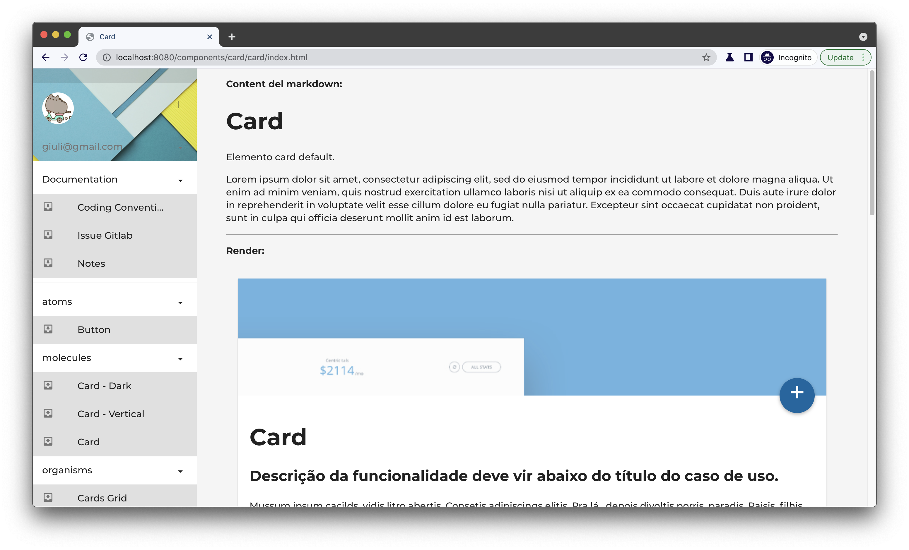
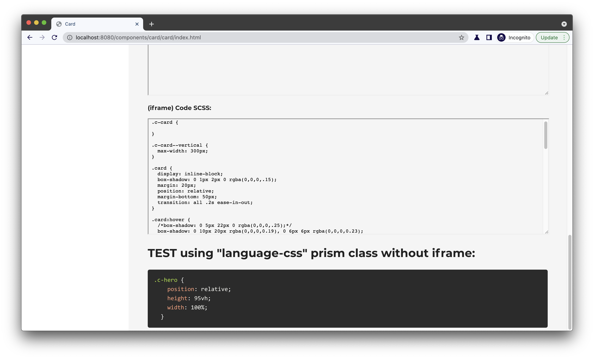

# Eleventy styleguide

Custom pattern library tool using 11ty static site generator.

| \                | \    |
|------------------|------|
| Deploy status    | \    |
| Deploy preview   | \    |
| Project typology | Tool |




## 🔥 Tech stack

| Purpose               | Technology   |
|:----------------------|:-------------|
| Templating            | Nunjucks     |
| Styling               | SCSS + BEMIT |
| Documentation         | Markdown     |
| Static Site Generator | 11ty         |

## 🌊 Run development mode

```shell
# install dependencies
npm i

# serve with hot reload at localhost:8080
npm run dev
```

Debug 11ty build

```shell
npm run debug
```

## 🧳 Build setup

```shell
# build for production
npm run build
```

### 🌿 Branches

| Branch name     | Use                       |
|:----------------|:--------------------------|
| `main`          | production                |
| `hotfix/5-temp` | NOT WORKING, check issues |

Note that component showing HTML raw source code does not work properly:

```html
<iframe
  srcdoc="../../../iframes/{{ slug }}.html"
```
